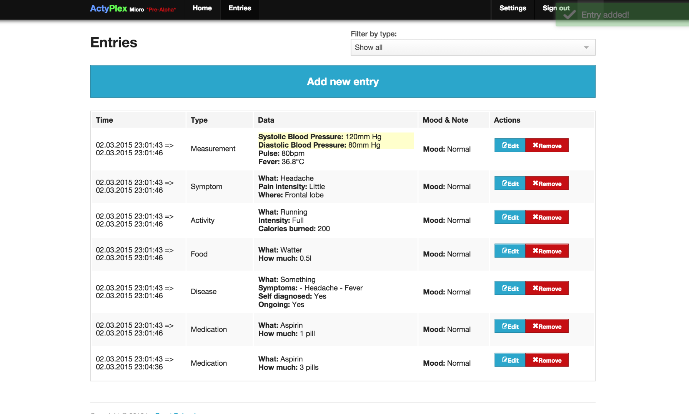
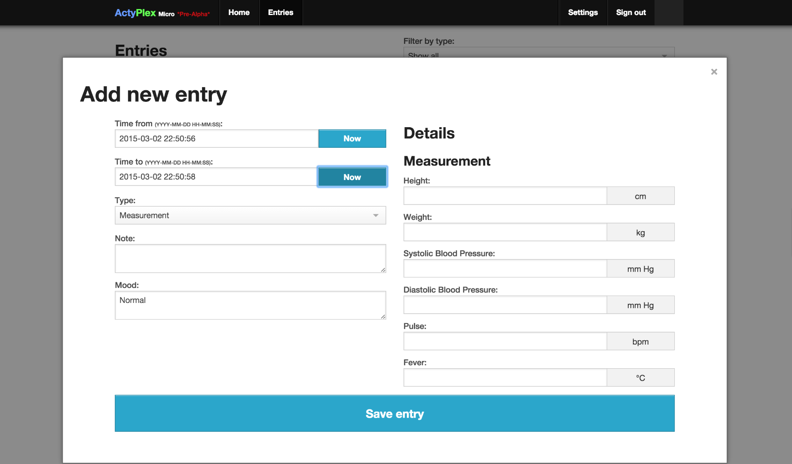
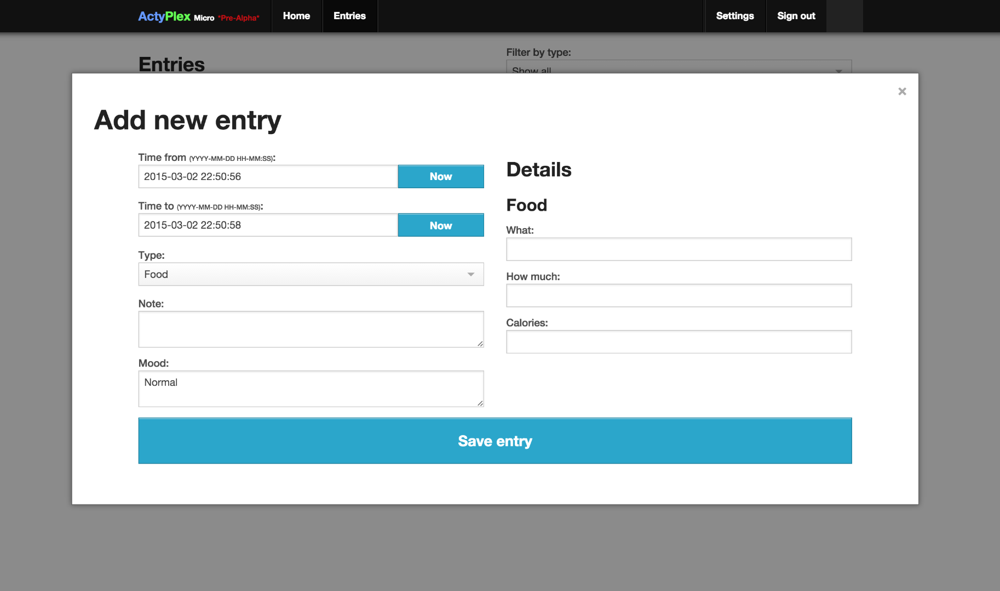

# Actyplex #
A web application, in which you can track your daily health status.

**Notes:** This application is NOT developed anymore. The project was developed back in 2011 or 2012. I've open sourced it just in case somebody may find it interesting or useful. Also, the security is horrible. You better not use that thing in the production. Rather just play around with it ...

Preview
----------------------

### Entries ###

### New Entry ###

### New Entry (more) ###

License
----------------------
Actyplex is licensed under the MIT license.
